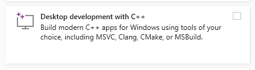
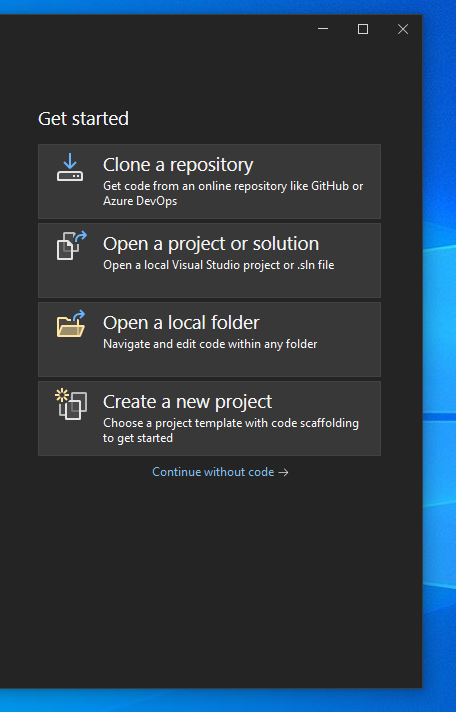
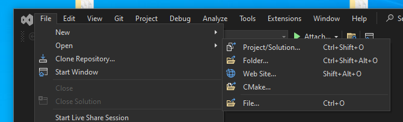
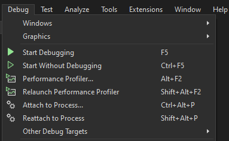

# Visual Studio

Northstar is easiest to debug through Visual Studio due to its cmake support.

* If you do not already have Visual Studio download it https://visualstudio.microsoft.com/
  * Its recommended that you install the Community version because it is freely availalbe.
  * You need to install the `Desktop development with C++` workflow to debug native programs    

* Open Visual Studio
* Select `Open a project or solution`    

  * If you already have a solution open you can open a new project through the menu bar    

* Open `NorthstarLauncher.exe`
* You can now debug Northstar    

  * You can find relevant debug symbols in [NorthstarLauncher releases](https://github.com/R2Northstar/NorthstarLauncher/releases)