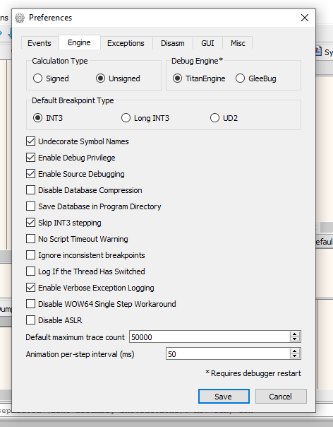

# x64dbg


If you are not experienced with x64dbg it its recommended to use [Visual Studio](visualstudio.md).


## Windows

* Download [x64dbg](https://x64dbg.com/)
* Extract the `release` folder somewhere on your PC
* Download the latest relase of [SycllaHide](https://github.com/x64dbg/ScyllaHide/releases/latest)
* Merge the contents of the `x64dbg` folder into the previously extracted `release` folder
* Run `x96dbg.exe`
  * You may receive a Windows SmartScreen prompt, x64dbg snapshots are not signed and will always cause these prompts
  * When running for the first time it will ask you some questions. After this is complete rerun the executable.
* Select `x64dbg` in the Launcher    

* Do make debugging easier it is suggested to change your settings to the following:
  * Keeping System Breakpoint enabled is optional but useful    

  * Skipping INT3 stepping is recommended to prevent generic breakpoints from stopping the program    

  * Make sure to select the exception before disabling breaking. If you are debugging a C++ Exception you need to ignore common exceptions that occur during runtime    

* Open `NorthstarLauncher.exe` in x64dbg
* You are now free to debug Northstar

## Linux


Debugging Northstar under Linux is not trivial due to the direct dependency on Origin, unless you know your way around wine its recommended to debug on Windows.


To simplify the use of x64dbg and automate running Origin a community member has created a script: [ns-linux-dbg](https://github.com/R2NorthstarTools/ns-linux-dbg)

To run it simply invoke it: `./nsdbg.py`    
It supports a variety of options as well as vanilla wine and Proton, use the help flag to see all possible options: `./nsdbg.py --help`
