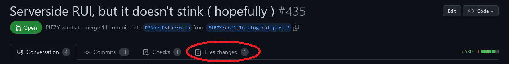
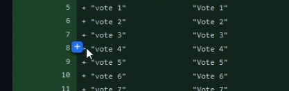
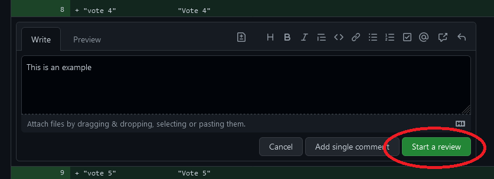
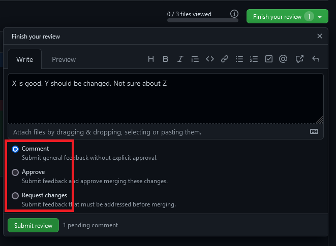

# Reviewing

For new pull requests to be merged into any of the Northstar repos, they need to reviewed to reduce the changes of introducing bugs as well as ensuring that in case of a feature it's something the community actually wants.

### Process

For a review there's two major parts **code review** and **testing**.

It's not necessary to do both when reviewing as long as you mention what you did when leaving the review comment on GitHub.

#### Code review

For code review head to the _"Files changed"_ section of the PR.

From there you can select the line(s) you want to leave a comment on.

Type in your comment and click on _"Start a review"_.

Note that this will **NOT** post your comment immediately! Add any remaining comments to other lines of code, then head to the _Finishing up_ section of this wiki page to see how to post your code review.

#### Testing

For testing a PR, refer to the following page


[testing.md](./testing.md)


The TL;DR is to test the aspect that has been changed.

#### Finishing up

After you performed the testing and/or code review leave a final comment by clicking on _"Finish your review"_ on the top right of the _"Files changed"_ page of the PR.

In your final comment make sure to mention what you did, e.g. which aspects of the change you tested for or what you considered during code review (formatting, edge cases, ...). The more detailed this part is the easier it is for other reviewers to tell which aspects they can skip during reviewing to speed up the process.

After leaving your comment, select the type of feedback.

* **Comment**: General remarks, use if neither of the later two applies.
* **Approve**: You found no issues when looking at the code or during testing.
* **Request changes**: Either something in the code doesn't look right or you found bugs during testing.


Approval reviews should **always** contain information about what parts of the code you looked at or tested. Approvals without comment or a single _LGTM_ are not useful and will be dismissed. \
Some exceptions to this rule are e.g. approving a single line comment typo fix, though even than the review should say something along the lines of "LGTM as it's just single line typo fix in a comment". In a nutshell it should be obvious to a future reader why you approved a PR without the reader having to look at the file diff first.

Contributors with reviewer access may see their role removed should they leave (multiple) empty/_"LGTM"_ reviews.

If you want to "approve" a pull request because you like the feature it implements, please opt for simply giving the PR a "👍" reaction instead.


Finally, click on _"Submit review"_. Your review is now publicly visible, congrats! :D
