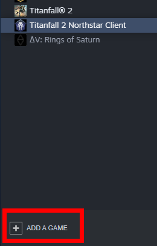
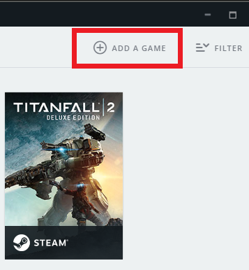
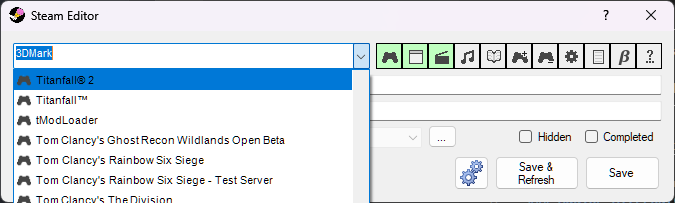
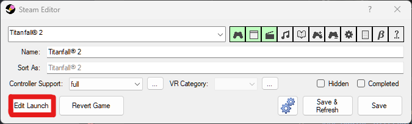
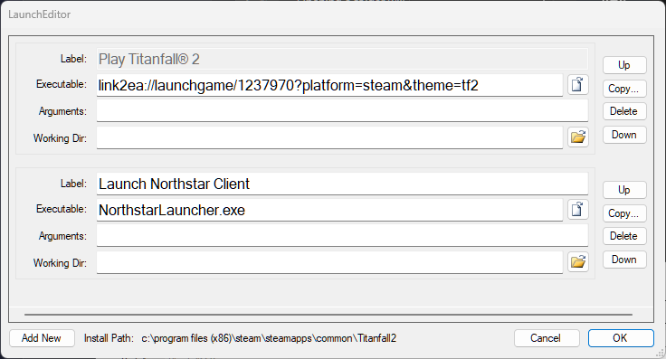
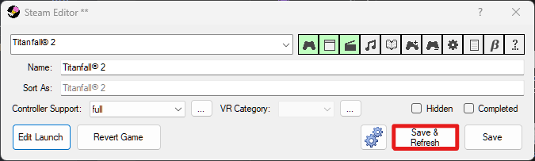
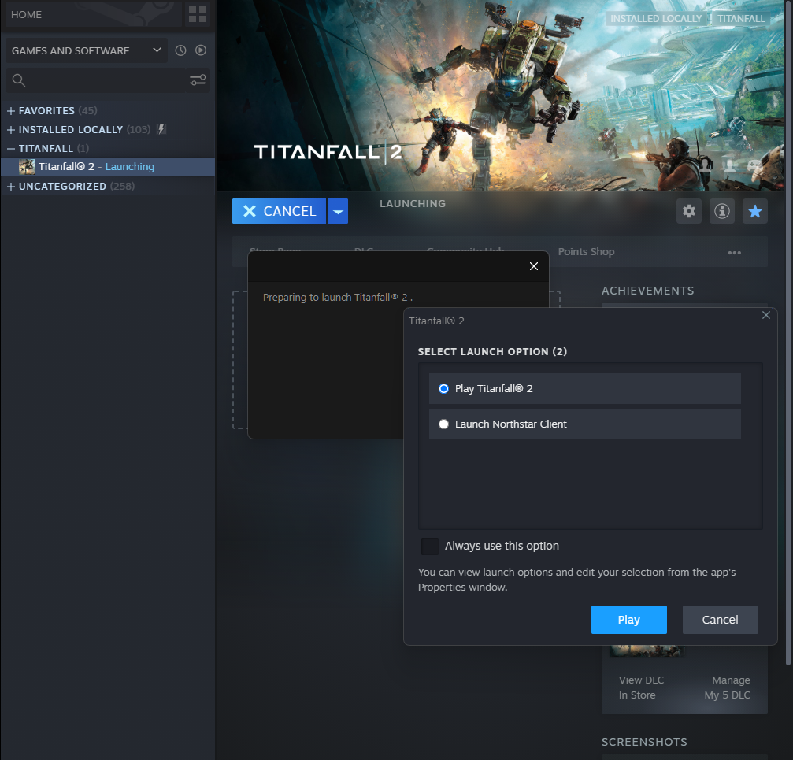

# Basic Setup

## Installing Northstar using an installer (recommended):

Head over to the installer page and pick one of the existing installers. All of these take care of both installing and updating Northstar.


[northstar-installers](northstar-installers)


## Manual installation

If you prefer to avoid any additional installers and know what you're doing, check out the guide for manual installation:


[manual-installation.md](manual-installation.md)


## Troubleshooting

Should you notice any issues/warnings/errors while running Northstar, check the troubleshooting page.


[troubleshooting.md](troubleshooting.md)


## Additional Stuff

You can launch Northstar via Steam, Origin, or EA using [launch options](troubleshooting.md#launch-opts). 

If Northstar doesn't appear to be installed, or you have issues entering the lobby, try running vanilla files. It's hard to say what VPK mods could cause issues with Northstar at the moment, so it'd probably be easiest just to try running unmodded.

Northstar can also be launched through Steam or Origin using the "add a game" feature. This allows you to register any .exe as a game. To set up Northstar, navigate to your Titanfall 2 folder and choose `NorthstarLaucher.exe`.

 

### Adding Alternate Launch Option for Steam

Steam can be configured to prompt for starting either Northstar or vanilla when Titanfall 2 is launched. This example uses [SteamEdit](https://steamedit.tg-software.com/), however another `appinfo.vdf`/`packageinfo.vdf` editor can be used.

Download [SteamEdit](https://steamedit.tg-software.com/), extract it, and run `SteamEdit.exe`. Select **Titanfall® 2** from the dropdown.

Click on **Edit Launch**.

Click on **Add New**.

Enter a name for Northstar and enter `NorthstarLauncher.exe` as the executable.

Click **OK** to close LaunchEditor, and click **Save & Refresh** to save your new configuration and restart Steam.

Launching Titanfall 2 will now display a prompt for vanilla and Northstar.

## Linux and Steam Deck

Install instructions for [Linux and Steam Deck can be found here](steamdeck-and-linux/installing-on-steamdeck-and-linux.md)
