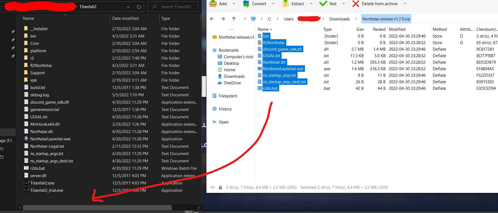
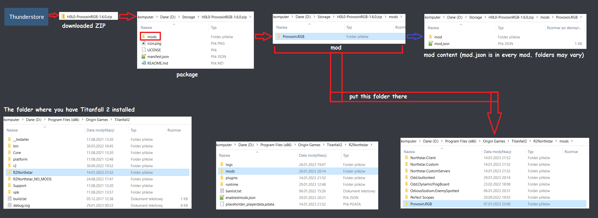
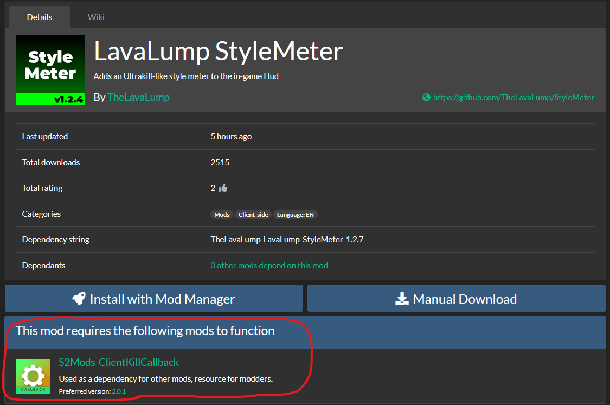

# Manual installation

## Installing Northstar:


Firstly, note that the Northstar client is only available on PC and requires you to **both own the game and have it installed**.

1. Download the latest version of Northstar from the [releases](https://github.com/R2Northstar/Northstar/releases) page
2. Copy all the files in the newly downloaded zip folder to your `Titanfall2` folder.\
   \
   The location of the `Titanfall2` folder can vary depending on whether you purchased the game off Steam, Origin, or EA App, and if you set a custom folder for game installs.
   * **For Steam** - Right click _Titanfall 2_ > Open _Properties_ > Click _Local Files_ > Click _Browse_\
     Usually: `C:\Program Files (x86)\Steam\steamapps\common\Titanfall2`
   * **For Origin** - To find the location of your Origin library go to _Origin_ -> _Application Settings_ -> _Installs & Saves_ -> _On your Computer_ -> _Game Library Location_\
     Go to the directory mentioned there using File Explorer and open the `Titanfall2` folder.\
     Usually: `C:\Program Files (x86)\Origin Games\Titanfall2`
   * **For EA App** - To find the location of your EA library go to _Settings_ -> _Download_\
     Go to the directory under "Install location" using File Explorer and open the `Titanfall2` folder.\
     ⚠️ The default location `C:\Program Files\EA Games\Titanfall2` is not writeable by non-admin processes. If you installed Titanfall2 in the default location using EA App, please move the install to a different location and change the install directory to the new location.
3. Launch `NorthstarLauncher.exe` to start Northstar
   * After launching for the first time, you'll be greeted with a popup requesting to authenticate to the master server. Click _Yes_ (This can be changed in the mods menu later if desired or if you accidentally selected _No_) to agree.\
     
4. Select _Launch Northstar_\
   
5. From the multiplayer menu, you can use the server browser to select and join any of the public community hosted servers.\
   

Should you notice any issues/warnings/errors while running Northstar, check the troubleshooting page.


[troubleshooting.md](troubleshooting.md)


## Updating Northstar

To update, first delete the core mods (`Northstar.Client`, `Northstar.Custom`, and `Northstar.CustomServers`) from `Titanfall2/R2Northstar/mods`.
Then, simply follow the same process you used to install Northstar using the newest zipped release of Northstar.

When copying the new files, if prompted, make sure to select "_Overwrite_".

Note that if you modified some files like `ns_startup_args.txt`, these will also be overwritten. If you want to keep the changes you made make sure to make a copy of these files beforehand and change them back after applying the update.

## Installing Northstar mods manually

Alongside installing Northstar, many users choose to install additional mods to replace/add any number of things in Titanfall 2. This guide will go over how to do this manually.

A quick image guide to installing mods can be found below:

If this doesn't make sense to you, you can follow the text guide below.

First, you'll want to find a mod you want from [Northstar's Thunderstore page](https://northstar.thunderstore.io/).

Once you find your mod, hit the `Manual Download` button near the top of the page. This will download the mod's Thunderstore package (note: NOT the mod itself).
While you're doing this, check if the mod requires any additional dependencies, which you can see in the area circled below:

If a mod says it has required dependencies (apart from Northstar), download them as well.

After this, open the folder that gets downloaded. Inside of here, you should normally see a folder called `mods`, and a few files called `icon.png`, `manifest.json`, and `README.md`.
From here, open the `mods` folder. Inside of here, you will find the actual folder for the mod. Move this folder to `Titanfall2/R2Northstar/mods`. Make sure to repeat this process for any and all dependencies the mod has.

Note that there are variants of these. Some mods you download from Thunderstore are actually packages of mods stored inside the `mods` folder in the Thunderstore package.
Some mods are formatted "improperly" (when following modding guides; though these aren't exactly "wrong") and won't have a `mods` folder, instead they just have the mod folder itself in the downloaded Thunderstore package.
