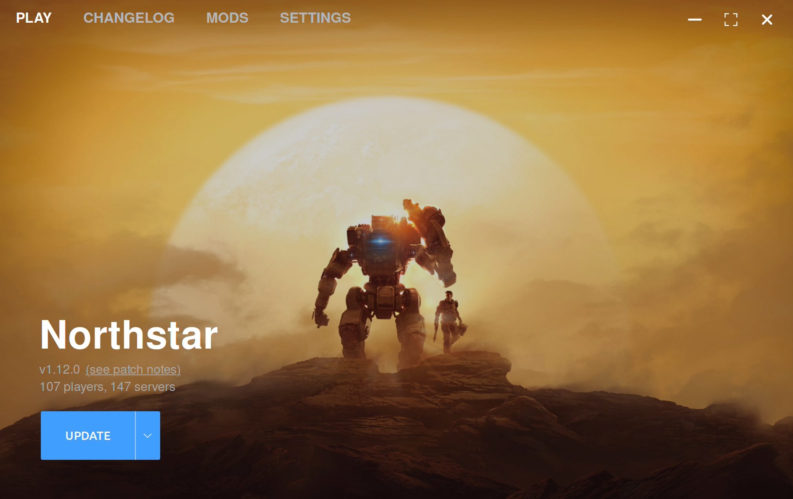
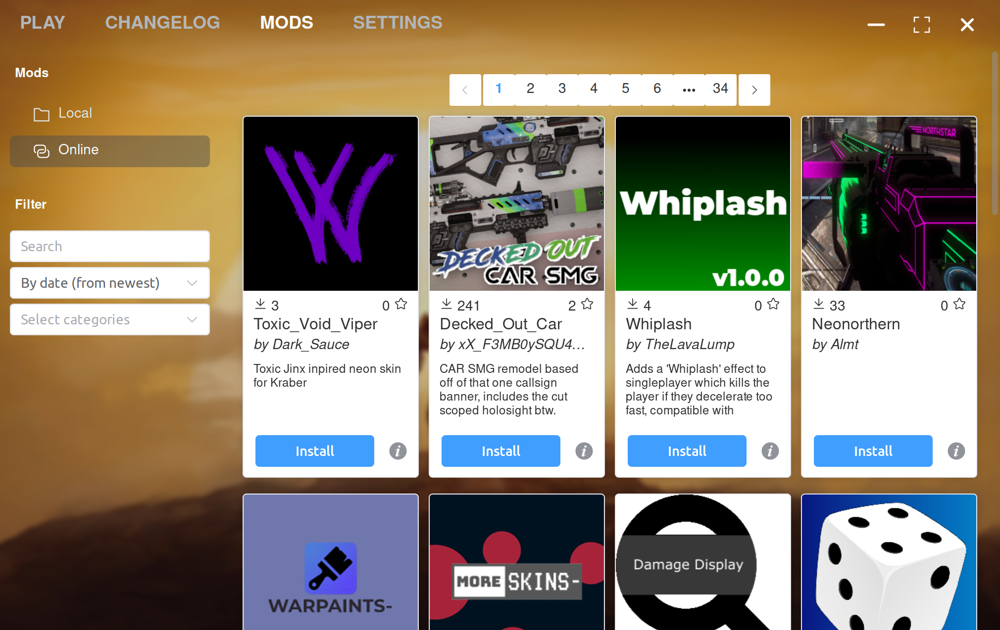
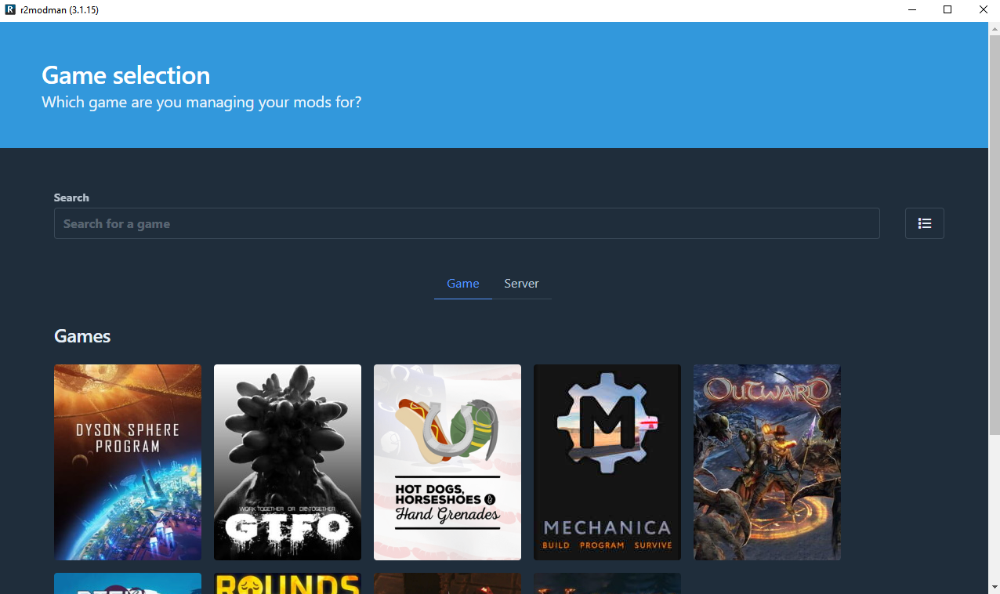
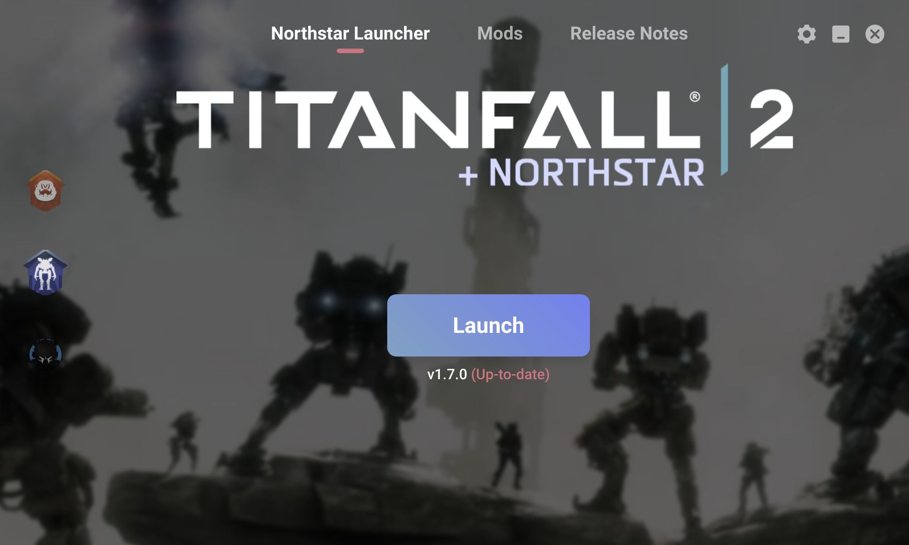
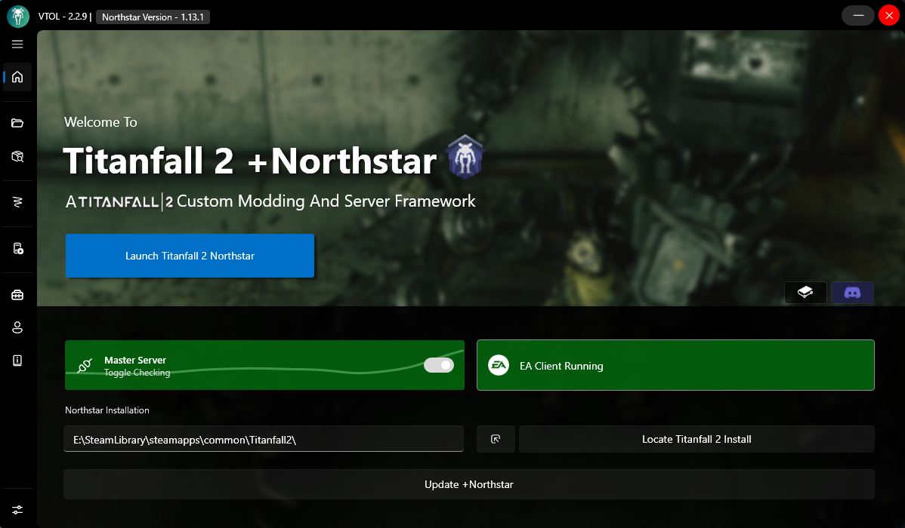

# Northstar Installers

Since the public release of Northstar, the wider community has created tools to automate mod installation, as well as adding additional features such as auto-updating the current Northstar install and mod management.

Each of these installers covers a different use case. Use the table below to find out which one suits you best:

| Features                        | FlightCore | r2mm | Viper | VTOL | Papa |
| ------------------------------- | ---------- | ---- | ----- | ---- | ---- |
| Install Northstar               | ✔️          | ✔️   | ✔️    | ✔️   | ✔️   |
| Update Northstar                | ✔️          | ✔️   | ✔️    | ✔️   | ✔️   |
| Launch Northstar                | ✔️          | ✔️   | ✔️    | ✔️   | ❌    |
| Launch Vanilla                  | ❌          | ✔️   | ✔️    | ✔️   | ❌    |
| Install Mods from Thunderstore  | ✔️          | ✔️   | ✔️    | ✔️   | ✔️   |
| Update Mods                     | ✔️          | ✔️   | ✔️    | ✔️   | ✔️   |
|                                 |            |      |       |      |      |
| Set launch arguments            | ❌          | ❓    | ✔️    | ✔️   | ❌    |
| Installing mods for other games | ❌          | ✔️   | ❌     | ❌    | ❌    |
| Linux support                   | ✔️          | ❓    | ✔️    | ❌    | ✔️   |
| Install Mods from GitHub/GitLab | ❌          | ❌    | ❌     | ✔️   | ❌    |
| Server config creator           | ❌          | ❌    | ❌     | ✔️   | ❌    |
| Package mods for Thunderstore   | ❌          | ❌    | ❌     | ✔️   | ❌    |

Note that none of these tools are directly part of the Northstar project and as such any issues with them should be reported to the respective authors instead.

## **GeckoEidechse:** FlightCore

Fast and easy to use Northstar installer, updater, launcher, and mod-manager. Features built-in mod browser and allows for easy installation of pre-release versions of Northstar.\
Supports Windows and Linux. 

Download and source code:



## **ebkr:** r2modman

General mod-manager for multiple games including Titanfall|2+Northstar. Allows for separate profiles to keep your game install folder clean. Features mod-manager and built-in mod browser for Thunderstore.\
Supports Windows and Linux.

Download from (select _"Manual Download"_):



Source code:



Wiki and documentation:



There's also an alternative version of r2mm called _Thunderstore Mod Manager_ TMM, which can be downloaded from here:\
(Contains ads to support the development of Thunderstore)



## **0neGal:** Viper

Simple and easy to use Northstar installer and auto-updater. Allows launching both Northstar and vanilla Titanfall 2. Features mod-manager and built-in mod browser for Thunderstore.\
Supports Windows and Linux.

Download and source code:





## **BigSpice:** VTOL

Easy to use and extensive Northstar installer and mod-manager. Supports installing from Thunderstore as well as from outside sources like GitHub/GitLab repositories. Has support for installing custom weapon/pilot skins. Features manager for setting up dedicated servers.

Download and source code:



## **AnActualEmerald:** Papa

Command-line only mod manager and Northstar installer written in Rust. Available for Linux as `.deb` and `.msi` Windows installer. Or build from source. Can install, uninstall, and update mods from Thunderstore.


