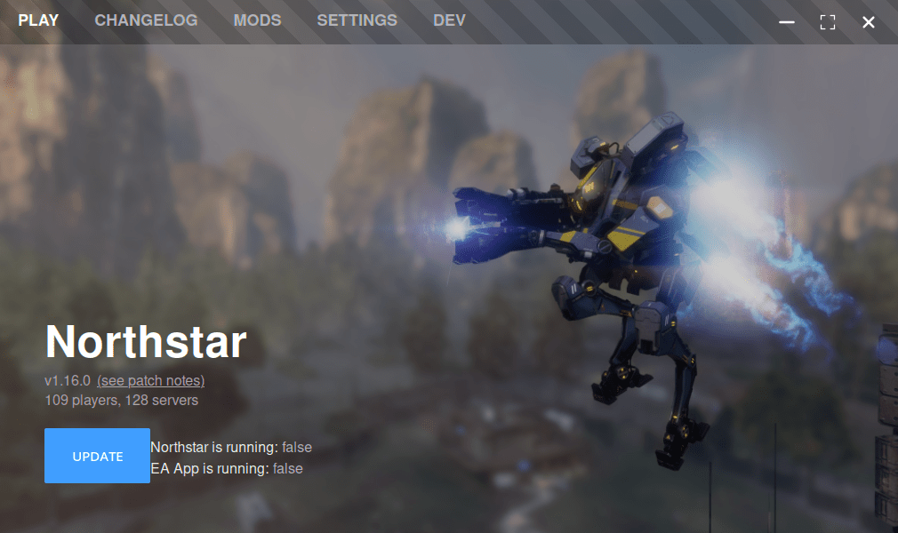
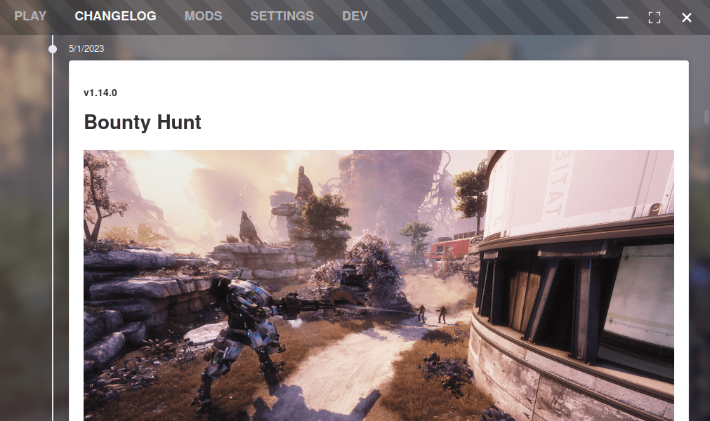
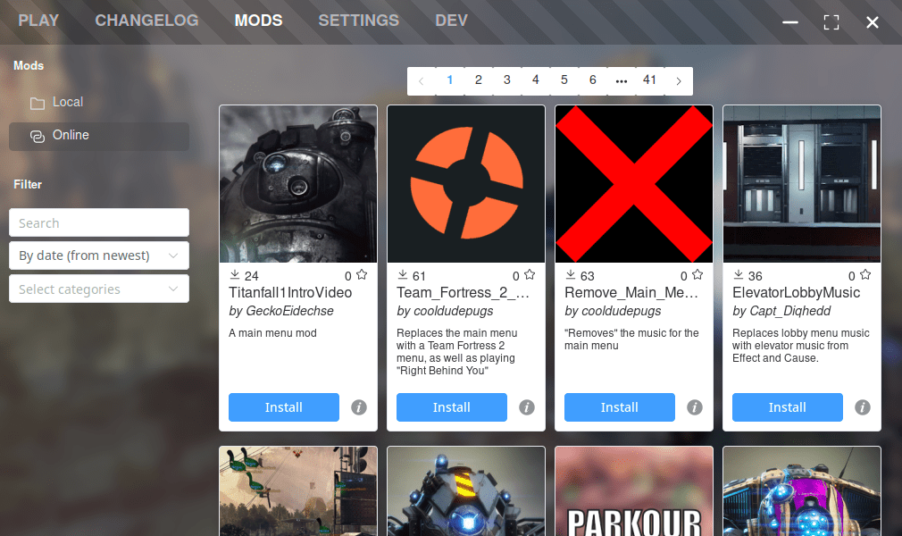
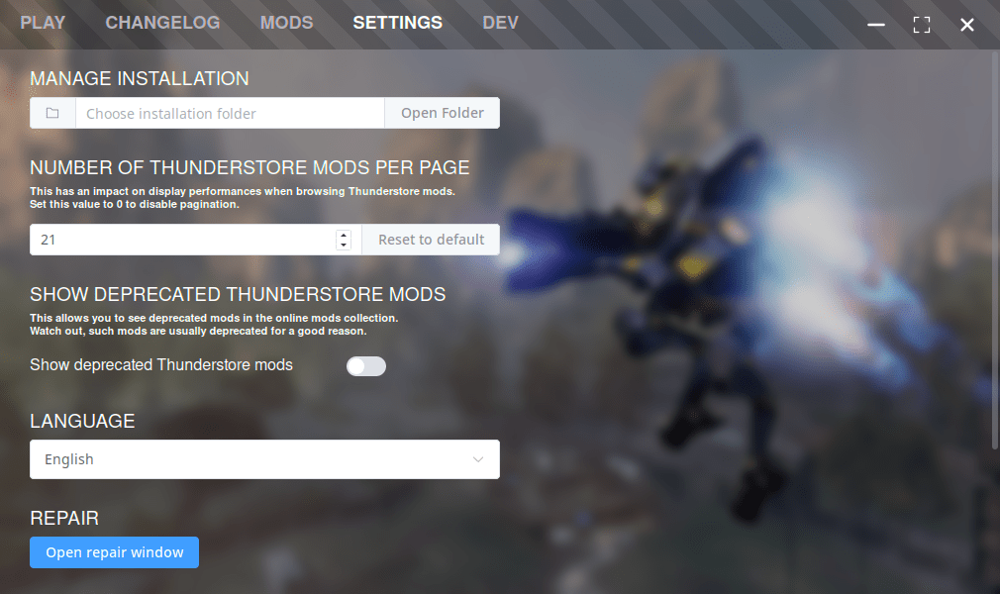

# FlightCore Guide

FlightCore is a Northstar installer and mod manager which allows for installing, updating, and managing mods for the Northstar client made for Titanfall 2.

Something to note is that FlightCore works on both Windows and Linux. The setup process is similar for both, except for the installation folder, and how you install FlightCore. 

## Windows Installation

Install the FlightCore file directly from the [Northstar website](https://northstar.tf), from [FlightCore's GitHub releases page](https://github.com/R2NorthstarTools/FlightCore/releases) (You want to download `FlightCore_X.Y.Z_x64_en-US.msi`, X Y Z being the version numbers of FlightCore), or by clicking the Windows download button on [FlightCore's GitHub page](https://github.com/R2NorthstarTools/FlightCore)

Then, run the `.msi` file this downloads, and it will automatically install FlightCore for you.

## Linux Installation 

For Linux, you want to download `flight-core_X.Y.Z_amd64.AppImage` (X Y Z being the version numbers of FlightCore) from [FlightCore's GitHub releases page](https://github.com/R2NorthstarTools/FlightCore/releases), put it in a place you prefer, then make sure to right click on it, click on properties, and tick `Executable as Program` (as shown below), then you can just double click it to open FlightCore.

## Main Menu

This is the *Main Menu* of FlightCore. It includes the *Play*, *Changelog*, *Mods*, and *Settings* tabs, all of which will be covered in the guide.

## Play 

The *Play* tab is actually the main window that FlightCore opens to. It includes some useful information in the bottom left, such as the version of Northstar you have installed, how many players are online, how many servers are online, and a button to launch Northstar.

## Changelog

The *Changelog* tab displays information from Northstar's [GitHub page for releases](https://github.com/R2Northstar/Northstar/releases), detailing what a new update to Northstar brings.

## Mods

The *Mods* tab of Flightcore can display either mods installed locally, or a browser for installing mods from [Northstar's Thunderstore page](https://northstar.thunderstore.io/). The default option it opens to when clicking the tab is displaying the mods you have installed.

`Local` displays mods you have installed currently, with options to toggle them on or off or delete them.

`Online` displays the Mod browser, which sorts by newest uploads by default. Hitting install on a mod will automatically install it, and hitting the *i* next to it will open the mod's information page on ThunderStore in your browser.

## Settings 

The *Settings* tab is the fourth and final tab of FlightCore. This tab allows you to view and choose your Titanfall2 directory (default directories can be found in the [Default Directories](../troubleshooting.md#game-location) section), select how many mods you want to see per page on the online browser in FlightCore, the version of FlightCore you're running, as well as a toggle to enable testing release channels.
