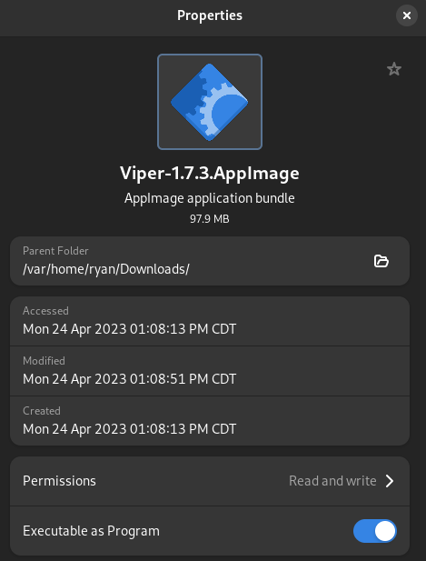
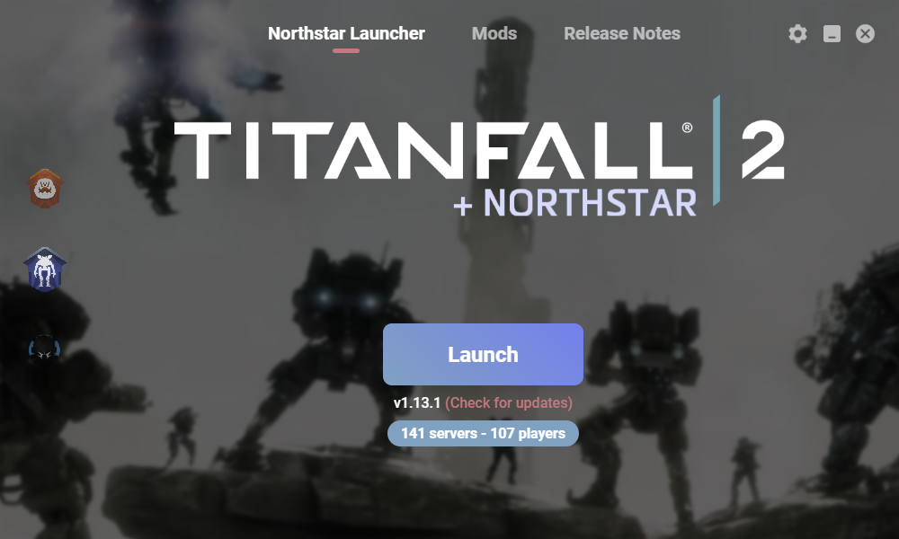
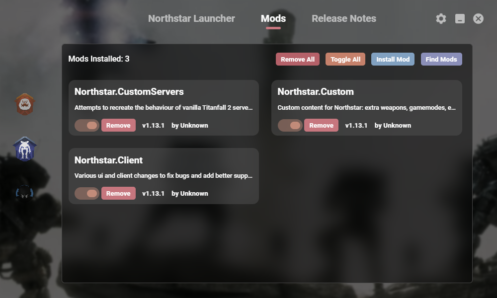
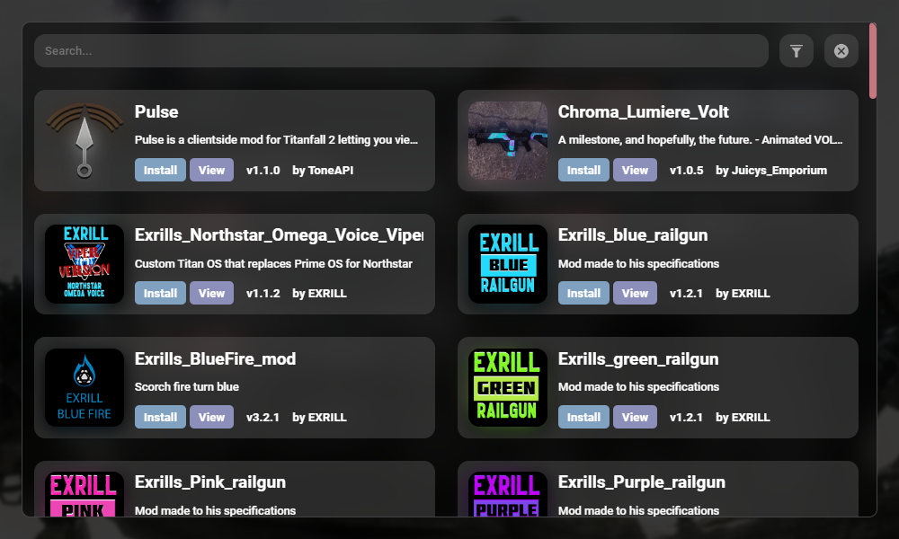
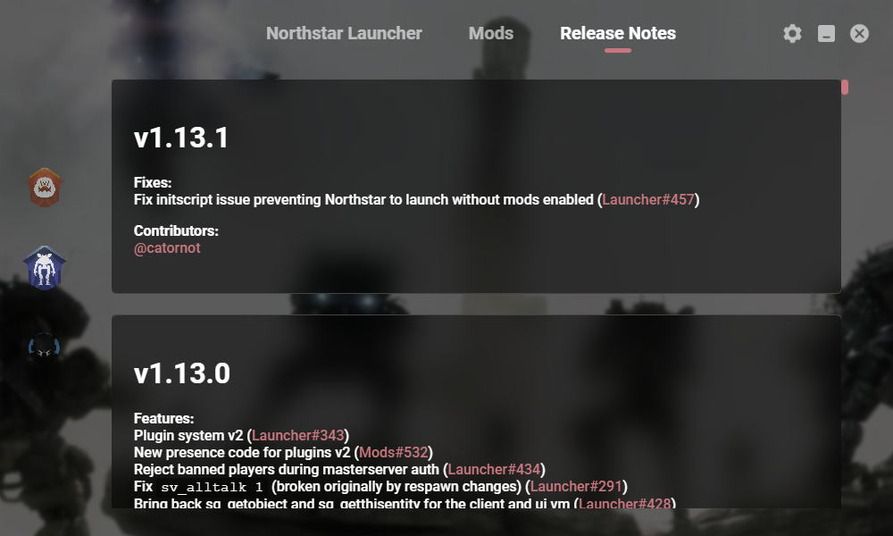
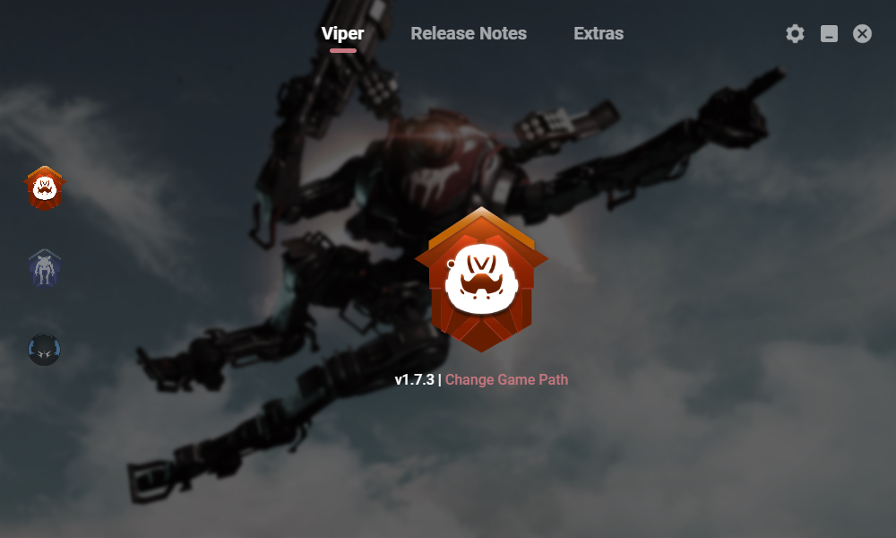
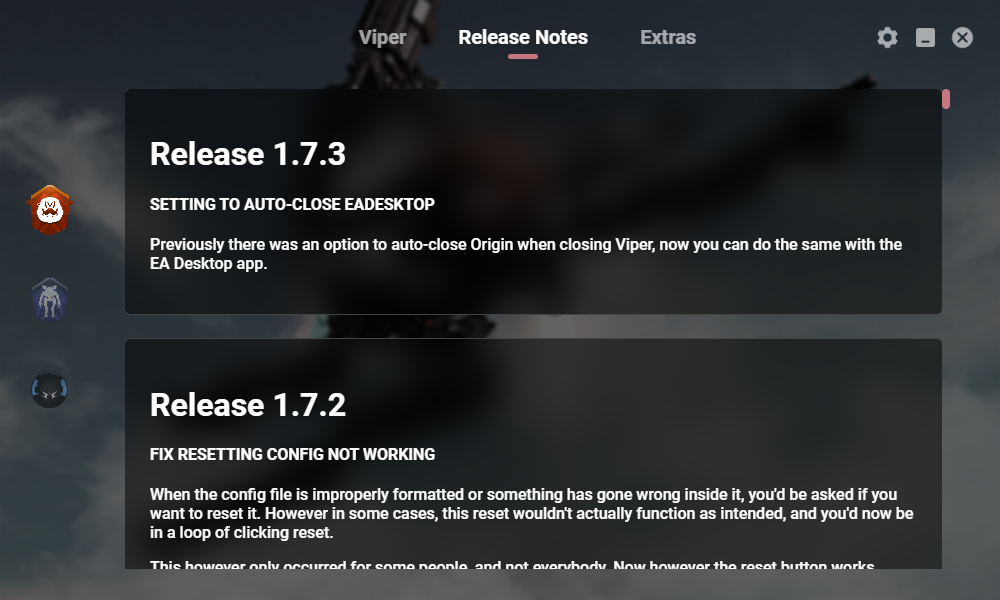
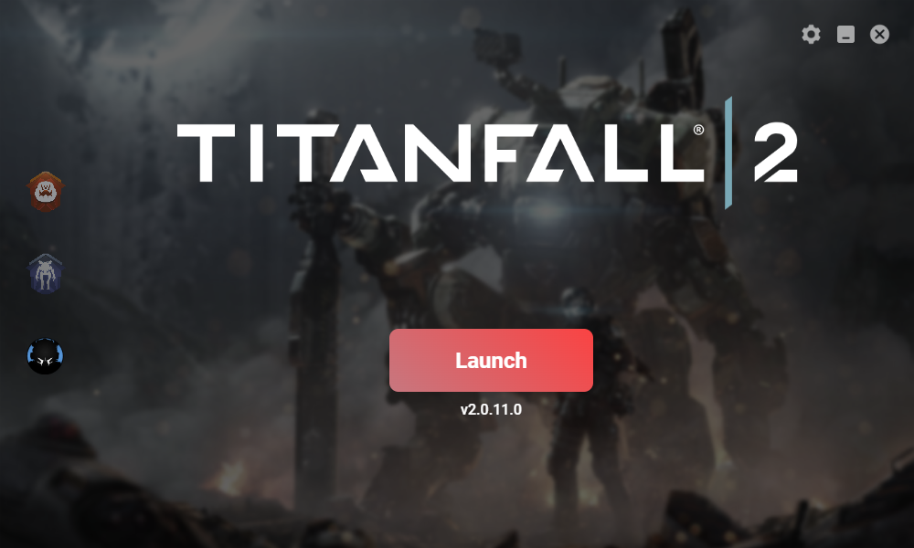
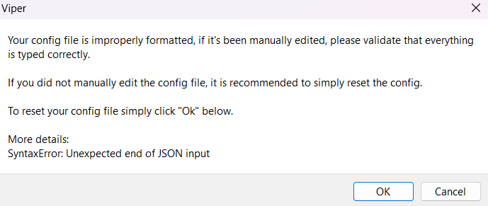

# Viper Guide

Viper is a mod manager/installer for Northstar, a community made mod for Titanfall 2, that automatically updates mods and Northstar versions.

Similar to FlightCore, Viper works on both Windows and Linux and has similar use cases, mostly differing in downloading Viper.

## Windows Installation

Install Viper from the [Northstar website](https://northstar.tf) or the Windows download button on [Viper's main GitHub page](https://github.com/0neGal/viper).

After this, run the file you downloaded to install Viper, then, if it doesn't automatically, open Viper.

## Linux Installation

To install Viper on Linux, you can either install the flatpak, or the `AppImage`. The flatpak version can be installed simply by using the command `flatpak install viper` in your terminal, which you can then open with your system, or by using the command `flatpak run com.github._0negal.Viper`. Viper's Flathub page can be found [here](https://flathub.org/apps/com.github._0negal.Viper).

To use the `AppImage` version, you want to download the [newest AppImage file](https://0negal.github.io/viper/?appimage), store it in a place that you want to, then you can allow it to be executed in one of two ways. Note that Viper will NOT automatically update when using the AppImage version.

The first way is changing the executable flag in a terminal. This can be accomplished by using `cd` to get to the directory you've stored Viper in, then typing in `chmod +x <AppImage>`, with you wanting to replace <AppImage> with the full name of the AppImage file you've downloaded.\
The second way is to right click on it, click on properties and tick `Executable as Program` on the AppImage file as shown below to allow it to be run on your computer. Double clicking the file after doing either one of these will launch Viper.

## Viper's Menus

Viper has 3 main menus, each with their own function. "Northstar Menu" refers to the Northstar menu on Viper, **not** a specific menu visible on all ways to install/launch Northstar.

### Northstar Menu

Viper's Northstar menu is the screen that Viper opens up to by default, with a large `Launch` button, as well as a version number for Northstar, and how many players and servers are online. It also automatically checks for a Northstar update on this screen. This screen also has sub screens, as listed below

This menu (when opened) shows you a list of your currently enabled mods, with version numbers, author names, and toggles to disable or remove them individually.

- `Remove All` would do just that, removing all of your mods.
- `Toggle All` would also do just that, toggling all of your mods.
- `Install Mod` is a button you can press and locate a mod folder installed to your computer, and Viper will install it for you.

The `Find Mods` button on Viper's mod screen allows you to search through [Northstar's Thunderstore page](https://northstar.thunderstore.io/) inside of Viper with the ability to quickly download a mod, as well as seeing the Mod's author and version number.

The `Release Notes` tab shows you the release notes for Northstar versions, which you can find [here](https://github.com/R2Northstar/Northstar/releases)

### Viper Menu 

This menu of Viper (the top one on the left sidebar) shows you the version of Viper you have installed, and an option to set your game path. Viper _should_ do this automatically, but some users may need to manually set this. Default directories can be found [here](../troubleshooting.md#game-location), or if you own the game on EA and have followed the [EA App directory issue section](../troubleshooting.md#cannot-write-log-file-when-using-northstar-on-ea-app), another common location is `C:\Games\Titanfall2`

This page shows the release notes for Viper versions, which you can find [here](https://github.com/0neGal/viper/releases)

The `Extras` tab of Viper displays some additional information, like credit for backgrounds used in Viper.

### Vanilla Menu

This menu allows you to Launch vanilla Titanfall 2 (no mods) easily, by simply hitting `Launch` on this screen

## Viper's Invalid Config issue

This error should be mostly resolved as of Viper version `1.7.2`, however if clicking `OK` doesn't seem to fix the error, you can manually delete the config file and allow Viper to recreate a functional one. You can do this on Windows by pressing `Windows + R`, typing in `%appdata%`, hitting `Enter`, then finding and deleting `viper.json` (if you can't see the `.json`, it's because Windows hides file extensions by default. You can turn them on by hitting `View` in task manager, then ticking the box that says `File name extensions`)\
On Linux, `viper.json` can be found in either the `$XDG_CONFIG_HOME` folder, if the XDG variable is set, or the `$HOME/.config` folder, if it is not set.
