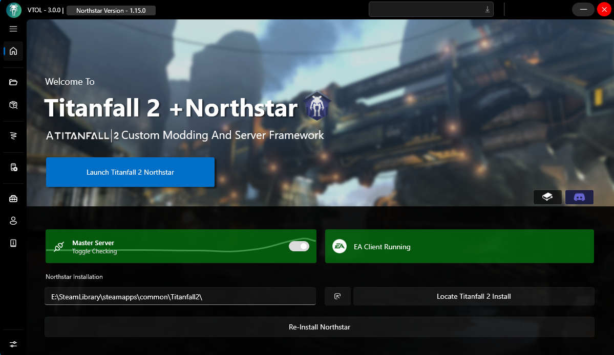
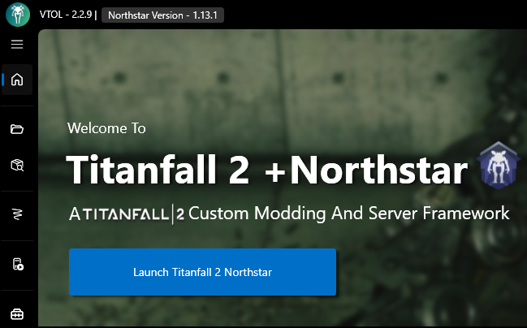
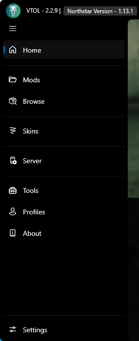
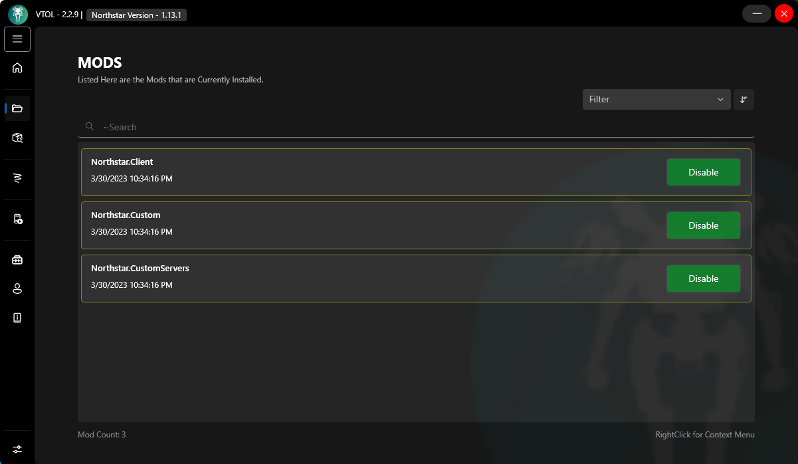

# VTOL guide

VTOL is a mod manager for installing and managing mods for the Northstar client made for Titanfall 2. You can find links to install it on the [Northstar Website](https://northstar.tf), or on [VTOL's GitHub page](https://github.com/R2NorthstarTools/VTOL).

## Main Menu

**The *Main Menu* of VTOL is where you'll probably spend most of your time.**

This menu has a lot of useful information, such as the *version of VTOL* you have, the *version of Northstar* you have, if the Master Server is online, *whether EA App/Origin are currently open*, and a *place to set your game path*. 

## Version Numbers

You can see what *version of VTOL/Northstar* you have in the top left corner of the VTOL window.

## Master Server/EA or Origin online

These small tabs near the middle of the VTOL window show you whether the Master Server for Northstar is currently online, and if EA or Origin is running properly on your computer. If the EA/Origin tab is red, solving that will be covered later (See: Settings section later on).\
If you are unsure if you have EA or Origin, you have EA.

## Northstar Installation/Locate Titanfall 2 Install

The final parts of the Main Menu are at the bottom, showing your game's directory with a button to Locate Titanfall 2 Install, a small button next to this, and a button reading "Update +Northstar"

## Installation Via VTOL

VTOL handles most things automatically, but it may still require minimal setup for some users.\

Something you might have to do manually is locate your Titanfall 2 Install. You can do this by pressing the button of the same name on VTOL, and navigating to your Titanfall 2 directory (If you're unsure of what your game path is, check out the [Default Directories](../troubleshooting.md#game-location) section)

After doing this, Northstar should automatically install. If not, the button at the bottom will read "Install Northstar". Let VTOL install Northstar, and you should be good to go. Once installed, this button will turn into the "Update +Northstar" shown in the screenshot earlier, which you can use to update without having to reinstall.

## Launching Northstar via VTOL

\
Assuming you've followed everything up to this point, you should be set to hit "Launch Titanfall 2 Northstar" and play on Northstar's servers. If you encounter an error like a crash, Northstar will create a log file in the "titanfall2/r2northstar/logs" directory. You can look at this log yourself, or send it on the [Northstar Discord server](https://discord.com/invite/northstar) and someone can try to look at it and help you.

## Additional Mods/Settings

## Tab List

\
The furthermost left side of VTOL has a list of tabs you can use for several different functions.\
To expand the smaller version of the tab list, press the button with 3 bars as shown below\
\
**NOTE: This guide will not be including the "Home" button as a tab when describing this list. When it says the first tab, it means the first tab underneath the home button**
## Installed Mods List

The first tab of VTOL is the "Mods" tab. This is a list of your currently installed mods, with the ability to disable any of them quickly.

You can also right click on a specific mod to get the option to either delete it, or look at the mod's information (Mod Name, Author Name, Description, etc.)\

## Installing Mods Via VTOL

VTOL has a built in browser for searching [Northstar's Thunderstore page](https://northstar.thunderstore.io/) (the website where most Northstar mods get uploaded to), located at the second tab "Browse" on the tab list. You will see the newest uploaded mods here by default, which you can change by applying filters (Note: The sorting is by default Low-High for filters. You can change this by pressing the button with an arrow next to the filters button, making it High-Low)

VTOL also has support where all you need to do is drag and drop a mod downloaded from the Thunderstore page onto the Mods tab (the second tab on the left side) to automatically install the mod

## Settings

On the way bottom of the tab list, there is a button to open settings for the VTOL manager. You will want to keep most of these on default, but change them as you wish. It is normal for the "Restart_As_Admin" button to appear untoggled. This is also where you can tick "Enable_EA_APP_Usage" to make the client work better with the EA app, assuming you have it and not Origin

## Skins

The third settings tab on VTOL is the "Skins" tab. VTOL has support for skins formatted for an older version of Northstar, normally requiring an extra tool. All you need to do is drag the folder of one of these old style skins onto the Skins screen to install it automatically.

## Server

The fourth tab on VTOL is the "Server" tab. This section allows you to add Launch Arguments to your client or dedicated server. Note that this adds Launch Arguments to change what Northstar does when it launches, not to launch Northstar itself. A way you can do this is by adding [Launch Arguments](../troubleshooting.md#launch-opts) via the store you own the game on and launching through there.

For the dedicated server option, you can scroll through this tab to set many different options for a server which can be found on the Northstar Wiki's [Server Hosting Guide](../../hosting-a-server-with-northstar/basic-listen-server.md)

## Tools

The fifth tab called "Tools" is meant to help those trying to create mods for Northsar. 

## ThunderStore Packer

The first screen is an area where you can locate your mod folder, and easily set up things such as the Name, Description, and Icon to be shown on the Thunderstore page when you go to upload your mod.

## Skin Tool

The second screen is an area where you can drag and drop images to the different maps of a skin to make your own skin. This is an implementaion of the [skin tool](https://github.com/zxcPandora/Titanfall2-SkinTool).

## Advocate

The third screen is an implementation of Spoon's [Advocate Tool](https://github.com/ASpoonPlaysGames/Advocate), where you can convert an old style skin mod to a mod that can be installed by everyone like a normal mod. Please give credit to the original skin owner while doing this. (If confused, following the earlier link to Github describes how to set up Advocate)

## External Tools

The fourth screen lists a lot of commonly used tools by modders to help create mods easier. You can get more info about each tool by clicking the information icon in the top right of the image for each respective tool.

## About

The last section of the VTOL client is the 6th tab of VTOL, the "About" section. This screen shows you what VTOL can do, as well as a button to configure updates, and a button to check for updates for the VTOL client.

# Credits 

[Juicy](https://github.com/BigSpice) for creating and upkeeping the VTOL Manager, as well as helping explain some things that I hadn't seen before
