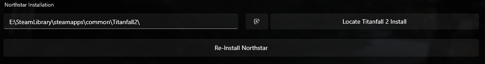
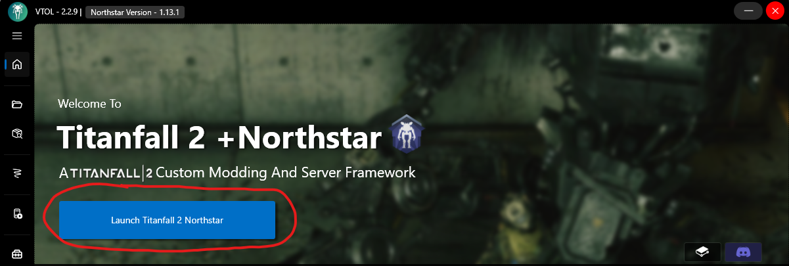
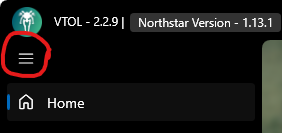
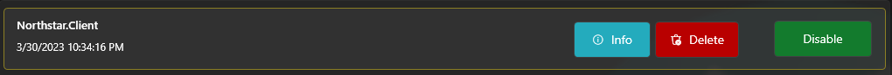

# VTOL Guide

VTOL is a mod manager for installing and managing mods for the Northstar client made for Titanfall 2.

VTOL works on Windows only and you can find links to download it on [Northstar's website](https://northstar.tf) or [VTOL's GitHub repo](https://github.com/R2NorthstarTools/VTOL).
Installing it from the website automatically installs the latest version that will automatically update itself.
On the GitHub repo, you can download the newest version by clicking one of two options. 
Note that the portable is just a `.exe` file and not the installer, as such it won't automatically update itself.

## Main Menu

**The _Main Menu_ of VTOL is where you'll probably spend most of your time.**

This menu has a lot of useful information, such as the version of VTOL you have, the version of Northstar you have, if the Master Server is online, whether EA App/Origin are currently open, and a place to set your game path. 

## Version Numbers

In the top left corner of the VTOL window you can see what versions of VTOL and Northstar you have installed.

## Master Server/EA or Origin online

These small tabs near the middle of the VTOL window show you whether the Master Server for Northstar is currently online, and if EA or Origin is running properly on your computer. If the EA/Origin tab is red, make sure to open EA/Origin first.\
If you are unsure if you have EA or Origin, you have EA.

## Northstar Installation/Locate Titanfall 2 Install

The final parts of the Main Menu are at the bottom, showing your game's directory with a button to Locate Titanfall 2 install, a small button next to this, and a button below both of these reading _"Re-Install Northstar"_.

## Installation Via VTOL

VTOL handles most things automatically, but it may still require minimal setup for some users.

Something you might have to do manually is locate your Titanfall 2 install. You can do this by pressing the button of the same name on VTOL, and navigating to your Titanfall 2 directory (If you're unsure of what your game path is, check out the [Default Directories](../troubleshooting.md#game-location) section)

After doing this, Northstar should automatically install. If not, the button at the bottom will read _"Install Northstar"_. 
Let VTOL install Northstar and you should be good to go. Once installed, this button will turn into the _"Re-Install Northstar"_ button shown in the screenshot earlier, which you can use to forcibly reinstall Northstar in the case something goes wrong with your Northstar install.

## Launching Northstar via VTOL

Assuming you've followed everything up to this point, you should be set to hit _"Launch Titanfall 2 Northstar"_ and play on Northstar's servers.
If you encounter an error like a crash, Northstar will create a log file in the `Titanfall2/R2Northstar/logs` directory. 
You can look at this log yourself, or send it on the [Northstar Discord server](https://discord.com/invite/northstar) and someone can try to look at it and help you.

## Additional Mods/Settings

## Tab List

The furthermost left side of VTOL has a list of tabs you can use for several different functions.\
To expand the smaller version of the tab list, press the button with 3 bars as shown below

**NOTE: This guide will not be including the _"Home"_ button as a tab when describing this list. When it says the first tab, it means the first tab underneath the home button**
## Installed Mods List

The first tab of VTOL is the _"Mods"_ tab. This is a list of your currently installed mods, with the ability to disable any of them quickly. Note that core mods (those that come installed with Northstar/those that start with `Northstar`) have a yellow border to differentiate them from normal mods.

You can also right click on a specific mod to get the option to either delete it, or look at the mod's information (Mod Name, Author Name, Description, etc.)

## Installing Mods Via VTOL

VTOL has a built in-browser for searching [Northstar's Thunderstore page](https://northstar.thunderstore.io/) (the website where most Northstar mods get uploaded to), located at the second tab _"Browse"_ on the tab list. 
You will see the newest uploaded mods here by default, which you can change by applying filters (Note: The sorting is by default Low-High for filters. 
You can change this by pressing the button with an arrow next to the filters button, making it High-Low)

VTOL also has support where all you need to do is drag and drop a mod downloaded from the Thunderstore page onto the _"Mods"_ tab (the second tab on the left side) to automatically install the mod.

## Settings

On the way bottom of the tab list, there is a button to open settings for the VTOL manager. You will want to keep most of these on default, but change them as you wish.
It is normal for the _"Restart_As_Admin"_ button to appear untoggled. This is also where you can tick _"Enable_EA_APP_Usage"_ to make the client work better with the EA app, assuming you have it and not Origin.

## Skins

The third settings tab on VTOL is the _"Skins"_ tab. VTOL has support for DDS format skins (the skins with the numbered folders in them), which are commonly used for Vanilla Titanfall 2, with Northstar generally opting to convert them to mods.

This format is older and less consistent than converting them to a mod to be used with Northstar (see [Advocate](./#advocate)).
It can still be used on Vanilla by playing [Vanilla via Northstar](../../using-northstar/vanilla.md#vanilla-with-mods).

However, if you want you can still install skins like this for use with Northstar.
All you need to do is drag the folder of a DDS format skin onto the Skins screen of VTOL to install it automatically.

## Server

The fourth tab on VTOL is the _"Server"_ tab. This section allows you to add Launch Arguments to your client or dedicated server.

For the dedicated server option, you can scroll through this tab to set many different options for a server which can be found on the Northstar Wiki's [Server Hosting Guide](../../hosting-a-server-with-northstar/basic-listen-server.md)

## Tools

The fifth tab called _"Tools"_ is meant to help those trying to create mods for Northsar. 

### ThunderStore Packer

The first screen is an area where you can locate a folder for a mod you've created, and easily set up things such as the Name, Description, and Icon to be shown on the Thunderstore page when you go to upload your mod.

### Skin Tool

The second screen is an area where you can drag and drop images to the different maps of a skin to make your own skin. This is an implementaion of the [Skin Tool](https://github.com/zxcPandora/Titanfall2-SkinTool).

### Advocate

The third screen is an implementation of Spoon's [Advocate Tool](https://github.com/ASpoonPlaysGames/Advocate), where you can convert a DDS formatted skin to a mod that can be installed by everyone normally without the need for the [Skin Tool](https://github.com/zxcPandora/Titanfall2-SkinTool).
If you're going to be sharing a converted skin that isn't yours, please give credit to the original creator.
(If confused on how to use this, follow the earlier link to Github that describes how to set up Advocate.
Do note, this version of Advocate isn't perfectly up to date)

### External Tools

The fourth screen lists a lot of commonly used tools by modders to help create mods easier. You can get more info about each tool by clicking the information icon in the top right of the image for each respective tool.

## Profiles

The sixth tab is the _"Profiles"_ tab, allowing you to create profiles for Northstar. Profiles are seperate Northstar installs, each with their own set of mods and seperated by folders. 
For example, you can have one profile with your normal set of mods and another profile for only using core mods (those that common with Northstar/the ones that start with `Northstar.`).

Hitting `Export Profile` will save your current profile to a `.vbp` file, which you can easily switch to by clicking `IMPORT` on the desired profile inside of VTOL.
You can also share your profile or download someone else's profile if they send you this file by hitting `Add Profile` and selecting the downloaded file. These files get saved to `Titanfall2/VTOL_profiles`.

## About

The last section of the VTOL client is the seventh tab of VTOL, the _"About"_ section. This screen shows you what VTOL can do, as well as a button to configure updates, and a button to check for updates for the VTOL client.
