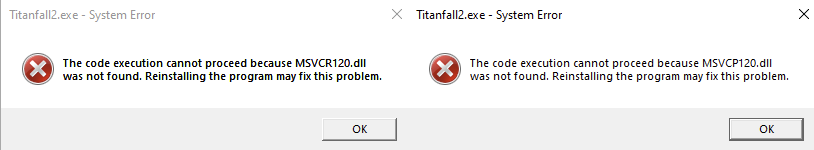

# Troubleshooting

Generally try to first launch the vanilla game (i.e. not Northstar) if you encounter any issue and see if it also occurs there as well. Some problems can occur when the vanilla game was never launched before using Northstar.

A lot of problems around the game failing to communicate with EA/Origin can also be prevented by launching EA/Origin before Northstar should you encounter any issues in that regard.

Also note that some solutions described below can also apply to the base game, like issues caused by [10th+ gen Intel CPUs](troubleshooting.md#intel).

## LSX Authentication Failed 

If the usual workarounds of restarting EA/Origin, rebooting your pc, or running the vanilla game first and then Northstar don’t work, try the following:

* First and foremost, double check that you are _logged in_ on EA/Origin. Titanfall will _not_ run if you are not connected to EA servers first (and neither will Titanfall + Northstar).
* Run the game with Steam/EA/Origin by adding [launch options](troubleshooting.md#launch-opts) instead of starting NorthstarLauncher.exe (important)
* Sign out and exit EA/Origin, then start Northstar. It will prompt you for a login, _hopefully_ fixing it if nothing else worked
* Start normal Titanfall 2 and then Northstar (_ONLY WORKS SOMETIMES_)

## Origin Offline/ORIGIN_LOGGED_OUT 

This error usually happens when the EA App fails to connect to EA servers properly. To fix this, you can:

1. Make sure you're signed into the EA App and can see Titanfall2 in your EA Library (only applies to Steam owners. If you can't, check [EA's official guide for linking accounts](https://help.ea.com/en/help/pc/link-ea-and-steam/).
2. Use task manager to end the `EA App` and `EA Background service` tasks, open the EA App, then launch Northstar.

## Tier0.dll Not found 

This error is usually caused by running the `NorthstarLauncher.exe` in the wrong location, such as extracting the zip it came with directly in your Downloads folder and running it there. The correct location is inside of the [titanfall2 directory](troubleshooting.md#game-location)

**If it still appears after trying the fix above:** It's possible that you may have **corrupted or missing** game files

* First check `\bin\x64\_retail\` and check if you have these files

* If you dont have them, [verify your game files](troubleshooting.md#verify-files)

## File Corruption Detected 

Don't panic! This warning isn't as serious as it seems. It's simply an incorrect error message caused by EA/Origin. If you get this warning after launching the game, try updating your Northstar install to the [newest release](https://github.com/R2Northstar/Northstar/releases), as this error was mostly resolved in version `v1.4.0`.

If that doesn't work, you should verify your Titanfall2 files. If you're confused on how to verify files, follow [this](troubleshooting.md#verify-files) guide.

## Failed copying wsock32.dll 

You are probably using the EA Desktop app and it sets up game installations with no write permissions contrary to EA/Origin.

### Solution 1

* Launch EA Desktop and the game as admin once so that it can copy that file.

### Solution 2

1. Copy `C:\WINDOWS\system32\wsock32.dll` to your Desktop / Temporary folder.
2. Rename the copied file to `wsock32.org.dll`.
3. Move `wsock32.org.dll` into `Titanfall2\bin\x64_retail\`.
4. Delete the copied `wsock32.org.dll` from your Desktop / Temporary folder.

Do NOT make any changes in `system32`, just copy the file.

### Solution 3

1. Locate your [Titanfall2 folder](troubleshooting.md#game-location)
2. Right click it and go `Properties > Security`
3. Give yourself write permissions

## Can't Join Servers (Issues with 10th+ gen Intel CPUs) 

On newer Intel CPUs you might see a message like this

> "Contacting Respawn servers.../Data Center: Searching..."

If you are seeing this in the main menu of TF|2 and have a 10th generation or newer Intel CPU this is a bug which has a simple fix:

In the Windows Start menu on the bottom left search for "Edit the system environment variables" and open the program. In the "advanced" tab click on "Environment Variables..." near the bottom.\
In System Variables (not user variables) click "New..." and add a new system variable where the variable name is `OPENSSL_ia32cap` and the value is `0x200000200000000`. Make sure to click OK to apply the changes. Finally restart your device and you should be good to go.

If you're on Linux, you can set the appropriate environment variable via `env OPENSSL_ia32cap=0x20000000 %command%`.

**Note:** This issue is not exclusive to Northstar client but also affects the vanilla version, so if you only get it on Northstar there might be a different problem at hand as well. In fact it's not even unique to Titanfall 2 either.

See also [this thread on Steam](https://steamcommunity.com/app/1237970/discussions/0/3081016749018656768/)

## I disabled all mods and now I cannot re-enable them 

Go to your [Titanfall2 directory.](troubleshooting.md#game-location) From there go to the `R2Northstar` folder and delete `enabledmods.json`. This file stores information about which mods are enabled and disabled. By deleting this file Northstar will fall back to the default (all mods enabled) and re-create the file appropriately.

## MSVCR120.dll / MSVCP120.dll Not found 

If you get this error you can fix it by [downloading and installing vcredist 2013 (`vcredist_x64.exe`)](https://learn.microsoft.com/en-us/cpp/windows/latest-supported-vc-redist?view=msvc-170#visual-studio-2013-vc-120).

## VCRUNTIME140 Not found 

If you get this error you can fix it by [installing vcredist 2015-2022 (`vcredist_x64.exe`)](https://learn.microsoft.com/en-us/cpp/windows/latest-supported-vc-redist?view=msvc-170#visual-studio-2015-2017-2019-and-2022). If it does not work install the 2013 version

## Launch Northstar Locked 

Go to Mods at the bottom of your screen on the main menu, then click Authentication Agreement and accept

## I can't open the console 

* Navigate to your [Titanfall2 directory](troubleshooting.md#game-location)
* Open `R2Northstar\mods\Northstar.Client\mod\cfg\autoexec_ns_client.cfg`
  * And change the \` to one of the F keys (for example `F1` / `F2`) (Note: _Only \~ or F1-12 work_) - This _should_ fix it
    * _Restart game!_

## The Main Menu is blank 

* Please remove conflicting mods such as `better.serverbrowser` and reinstall _Northstar core mods_ (those that start with `Northstar.` / are in the [NorthstarMods repository](https://github.com/R2Northstar/NorthstarMods) / included in the release zip).
* Try deleting `enabledmods.json` inside the R2Northstar folder as well.
* Otherwise pay attention in console for your errors if you know what you're doing.

## Finding Game Location 

On Steam or EA, the easiest way to find where the game is installed is as follows:
* Steam: Right click Titanfall 2 in your library, hover over `Manage`, click `Browse local files`. This will open the `Titanfall2` folder
* EA: Click the 3 dots in the top right of the Titanfall 2 icon, click `View Properties`, and it will be listed under `Install location`. You can click `BROWSE` to open the `Titanfall2` folder

Otherwise, the default install locations are listed below:
* Default Steam Location: `%ProgramFiles(x86)%\Steam\steamapps\common\Titanfall2\`
* Default EA Location: `%ProgramFiles%\EA Games\Titanfall2\`
* Default Origin Location: `%ProgramFiles(x86)%\Origin Games\Titanfall2\`

## Adding Launch Options 

Adding `-northstar` will start Northstar when launching from your library\
Adding `-nonorthstardll` or removing the `-northstar` will start the normal game when you have Northstar installed

* For Steam
  * `Your library > Right click TF|2 > Properties > General > Launch Options > -northstar or -nonorthstardll`
* For EA app
  * `My collection > Click the three dots on TF|2 > Properties > Advanced launch options > -northstar or -nonorthstardll`
* For Origin
  * `Your library > Right click TF|2 > Game Properties > Advanced Launch Options > Command Line Arguments > -northstar or -nonorthstardll`

## Verifying Game Files 

This is a small guide to help you understand how to verify the files of your game

* For Steam
  * `Your library > Right click TF|2 > Properties > Installed Files > Verify integrity of game files...`
* For EA app
  * `My collection > Click the three dots on TF|2 > Repair`
* For Origin
  * `Your library > Click on TF|2 > Click the gear icon > Repair`

## Controller Not Working 

If your controller isn't working on Northstar, there are a couple ways you can make it work via Steam's controller settings.

If you own Titanfall 2 on Steam, you'll want to add [launch options](troubleshooting.md#launch-opts) and open Titanfall 2 on Steam to launch Northstar.

If you _don't_ own Titanfall 2 on Steam, you'll want to add Northstar as a Non-Steam game and launch the added game via Steam.\
To do this, go to Steam, then in the bottom left corner, hit `ADD A GAME` > `Add a Non-Steam Game...` > `BROWSE...` > Find `NorthstarLauncher` in your [titanfall2 directory](troubleshooting.md#game-location)

## Access Violation

If your error says `Access Violation | Attempted to read from 0x00000000` specifically DO NOT post just THAT.\
The real error is most likely slightly higher. Please post that in issues or the discord

## I can't play the Campaign 

Northstar does allow you to play campaign since version `1.11.2`, however it should be noted that certain mods will attempt to run while playing the campaign, leading to it breaking.
If you experience a compile error when trying to play the campaign, try to see if the error mentions a file related to a mod that you can recognize. Otherwise, join the Northstar Discord server and create a ticket in the `#help` channel.

An alternative solution is simply playing Vanilla Titanfall 2 for the campaign.

## Authentication Failed when clicking Launch Northstar 

Before trying this check out [this section](troubleshooting.md#lsx).\
Alternative to that fix:

1. Close the game
2. Open task manager
3. End EA/Origin (everything EA/Origin related)
4. Launch EA/Origin as admin
5. Start the game through Steam/EA/Origin with `-northstar` in [launch options](troubleshooting.md#launch-opts)
6. See if that fixed it

## Could't Initialize Sound / DEVICE\_IN\_USE 

If message contains: `AUDCLNT_E_DEVICE_IN_USE`

1. Go to Windows Search Bar, type `mmsys.cpl`, press enter.
2. Make sure you selected the right audio device as default (your headset or speakers usually).
3. If it still does not work, disable exclusive mode on your default device: 
4. Restart your computer.

This issue could also be caused if you use some sort of audio wrapper to control volume and stuff like Voicemeter Banana. The above fix was tested with Voicemeter Banana.

## Windows 11 AutoHDR disabled while using Northstar

You need to launch Northstar via Titanfall 2 by setting up [launch options](troubleshooting.md#launch-opts) and launching the game from your library.

Relevant issue on GitHub: [https://github.com/R2Northstar/Northstar/issues/284](https://github.com/R2Northstar/Northstar/issues/284)

## I used a command to set my player/gun XP level and I set it too high so now my game crashes when trying to join multiplayer


The following command will reset all your loadouts and levels!


Open console in-game in main menu, type in `ns_resetpersistence` and press enter. Close console again and click on "Launch Northstar". All your stuff should now be reset.

## Couldn't find player account/Invalid Master Server Token 

This is an error commonly caused by EA not properly updating players' names when launching Northstar, especially prevalent for people who have changed their EA username before.

The current solution to this is signing out of the EA App, then _without signing back into the EA App_, open **Vanilla** Titanfall 2. This should prompt EA App to pop up and ask you to sign in again, sign in on that prompt. Close Vanilla Titanfall 2 and open **Northstar**, and the error should be fixed.

Another common issue that can cause this error is when Steam and EA accounts aren't properly linked (Note: this only applies if you own Titanfall 2 on Steam). To check if this is the case, you can check if you see Titanfall 2 in your library on the EA App (yes, even if you own it on Steam). If you see it, then try the other solutions again. If you don't see it, follow [EA's official guide on linking Steam and EA accounts](https://help.ea.com/en/help/pc/link-ea-and-steam/).

This error can also appear if you are pirating the game, which we neither condone nor support as stated [here](../faq.md#faq-piracy)

If none of the previous solutions apply, you can try logging out of the EA App, closing all EA related proccesses (including background ones) using task manager. After this, manually reopen the EA App, log in, and try to launch Northstar again. (If you don't know how to use task manager, press `"ctrl + alt + delete"`, select Task Manager, and hit `"More Info"` on the bottom right. If you can't see more info, then you've already clicked it before and don't need to do it again. After this, when you right click on a process it will open a small pop up with`"End Task"`as an option, which is what you want to use).

## Disable EA App overlay 

The purpose of disabling the EA App overlay is to increase performance, as it can be very taxing even on high end hardware. You can disable it by clicking on your profile in the top right of the EA App, clicking on the drop down arrow, going to settings, going to `Application`, then scrolling down and disabling the EA App overlay.
This will also disable invites, however [Northstar does not use these](../faq.md#faq-invite-friends)

## Cannot write log file when using Northstar on EA App

The default install location for EA App `C:\Program Files\EA Games\Titanfall2\` is not writeable by non-admin processes. This messes with Northstar trying to write log files as well as mod-managers trying to install mods.

Therefore the recommended solution is to move the install to another location (can even be on the same drive). This prevents the non-admin issue and as such should solve the issue of Northstar being unable to write logs and failing.

The recommended solution can be done by moving the Titanfall 2 folder from the default location to something like `C:\Games\Titanfall2\`. Create this folder if it does not exist (it can be named whatever you want but `Games` makes it simple to know what's in the folder. The folder can be on any drive whether `C`, `D`, or other).\
After doing this, you will need to open the EA App, go to _Settings_, go to _Downloads_ and change the install directory in the settings. Click _"Edit"_ next to _"Install Location"_ and navigate to your new directory that you put Titanfall 2 into.

Restart EA App after doing this, and the issue should be resolved. If not, hitting _Install_ on Titanfall 2 should prompt EA App to look for the files, or ask you to set the game's directory.
