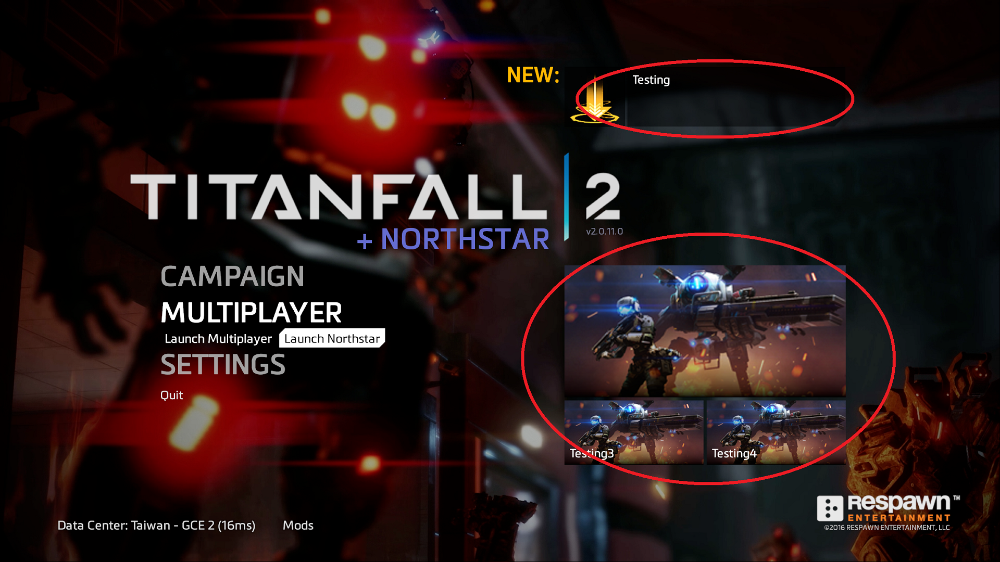

# Deploy

## Development

A Development Master Server uses http requests, it should be used for development purposes on your local machine.

### Installation steps

1. Clone [NorthstarMasterServer](https://github.com/R2Northstar/NorthstarMasterServer).
2. Copy the default [dev.env](https://github.com/R2Northstar/NorthstarMasterServer/blob/main/dev.env) to `.env` replace the ip with `127.0.0.1`.
3. Run `npm install` && `npm run watch`.

Your master server is now running, to connect to it you need to change some configuration files.

Northstar default masterserver is https://northstar.tf, to point to a new location you need to modify this URL in the `autoexec_ns_server.cfg` and `autoexec_ns_client.cfg` config files.

### Enabling Main Menu Promos



To enable the main menu promos (like the red circle in the above photo), you need to duplicate and rename the file `mainmenupromodata.template.json` to `mainmenupromodata.json` in directory `client`. And change the content that you want to promos in the file to be shown correctly to the client.

### Enabling HTTPS

HTTPS should be used if you plan for other people to use your master server. It can be enabled pretty easy with [Caddy](https://caddyserver.com/). Download a Caddy binary and create a `Caddyfile` with the following content:

```
{$SHORTDOMAIN:localhost} {
    reverse_proxy http://127.0.0.1:8080
}
```

After configuring your DNS domain you can run it with `SHORTDOMAIN=example.com caddy run`. Caddy will automatically generate and maintain your certificates for you, check its documentation for more info: https://caddyserver.com/docs/
