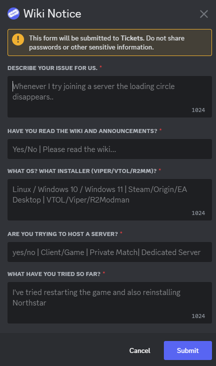
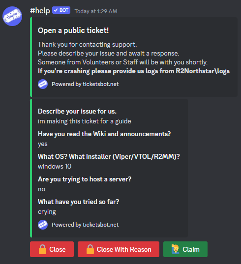

# Helping

This section is meant mostly for those that will be actively helping others in the Northstar Discord server or otherwise.
If you've somehow stumbled upon this page trying to fix an issue for yourself, you should try checking the [troubleshooting page](../installing-northstar/troubleshooting.md) instead. 
If you're a helper, it also isn't a bad idea to look at this page a few times and try to have a rough idea of the things that are on it.

When helping a user, please try to move them to the `#help` channel to create a ticket in order to keep public channels less cluttered. 

If they really don't want to open a ticket or you don't want to deal with a ticket, ask them to move to `#northstar-chat`. 
There, not only can they embed things, but it'll be slightly more focused on helping than other channels would be.

Arguably the most important things to know as a helper are the ability to read logs and deal with users that don't read the wiki (90% of tickets are solutions solvable by checking the wiki.
There is a pretty high chance that even if the user claims they read the wiki they didn't actually do so or didn't manage to find their issue on there)

The first section will go over extremely common issues and their tags, then the basics of using the ticket bot for commands inside tickets

Additionally, please don't be afraid to ask for help. The entirety of `#volunteers-chat` in the Discord server is specifically for those that help/sometimes help users and there's no shame it not knowing.

## Common issues and their tags

In the Northstar Discord server, a massively used device to help end users is the tickets bot. A lot of the common issues and questions that come up have tags for them on the Discord server. 

Tags are bits of information that you can easily access by using a slash command.
We use them mostly for common questions (such as the tag explaining how you can spawn the double barrel shotgun and that you can't spawn it in most servers), and for linking directly to specific pages on the wiki (such as the section about [Intel gen 10+ cpus](https://r2northstar.gitbook.io/r2northstar-wiki/installing-northstar/troubleshooting#intel)).

The tag command for the tickets bot is `/tag`, and you can either type `/tag id:{TAG ID HERE}` or let the bot autofill the tag for you after typing `/tag` and selecting the tag id from the list (make sure you select the ticket bot, and not Dyno!). 
Note, you can't reply to a user while using a slash command, so try to reply to the bot's message after sending the tag command while pinging the person it's directed at and informing them that they should follow the provided solution.

You can find a list of these tags on the [tag dashboard for the help bot](https://panel.ticketsbot.net/manage/920776187884732556/tags), so long as you sign in using your Discord account and have access to it with the roles that you have.

## Ticket channel commands

This entire section only applies to users with `ticket-staff`+ roles who can see the ticket channels in the Discord server

The tickets have a fairly straightforward way of operating.
When a user clicks on a button to open a ticket they're greeted with the following screen:\

If you or the end user are curious about the difference, a staff ticket can be viewed by anyone with the helper role or above, while a public ticket can be viewed by anyone with the ticket-staff role or above

Once they hit a button to open a ticket, they will fill out the popup with information which will later be shared in their ticket as a message sent as an embed by the ticket bot. 
This will be the first message in the channel and will look something similar to this:\

Note the buttons below the embed.\
Hitting `Close` will close the ticket without a reason for closing it.\
`Close with reason` will let you give a reason as to why you closed the ticket.\
`Claim` allows you to "claim" a ticket and lets other helpers know that you'll be solving the ticket. 
This doesn't usually get used for Northstar, however other helpers can still message in the channel even after it's claimed so don't worry if you accidentally claim a ticket/end up not being able to solve it.

These buttons, however, are not always easy to scroll back up to, especially if the ticket has been open for a while. This is where slash commands come in.

There are 3 major slash commands used for tickets. These are `/close`, `/closerequest`, and `/add`.

`/close` by itself will close the ticket immediately, without a reason. Because it's a slash command however, you can give a reason for closing using the `reason` option when typing the slash command.

`/add` will add a normal (non ticket-viewing) user to a ticket. This is useful if, for example, someone who created a mod and can't see the tickets has one of their mods cause an error for a user and you can't diagnose it. This is also useful for cases where someone opens a ticket for someone else.

You may have noticed that `/closerequest` has been skipped. That's because there's sort of a "etiquette" surrounding it.

Generally, you _should_ use `/closerequest` for closing a ticket. There's much less chance the end user gets upset, and it can be denied last minute if another issue comes up.\

From here, the user can accept the close request, which in turn closes the ticket, or deny the close request, while results in an edited embed telling you they denied it.

To _use_ the `/closerequest` command, there are a few "ways" to use it.\
Note that `close_delay` is a number, meaning the time in hours before the ticket autocloses.\
`reason` is a box to input the reason for a close request.\
Using "ac" as described later lets other people know how long until the ticket will close ("ac" meaning **A**uto **C**lose). This helps yourself and others when looking at tickets because the tickets bot doesn't show when a ticket is set to auto close.

If the ticket seems resolved/the user has said they have no issues, use `/closerequest` with `close_delay` set to `12` and the `reason` set to "resolved, ac 12hr"

For tickets where the end user that opened the ticket _never_ responded, we usually wait a couple days, ping them a few times, and if they continue to be inactve, set a close request with `close_delay` set to 24 and the `reason` set to "no response, ac 24hr"
For inactive tickets (when it's the _user_ not responding, not us!) we usually give them a few days and then start pinging them once a day. 
If they continue to not respond for 2-3 days, we tend to set a close request with `close_delay` set to `48` and the `reason` set to  "inactive ticket, ac 48hr"

You can also use `/closerequest` without giving a `close_delay` or a `reason`, however you should always try to give a reason for closing a ticket, and if you don't give a `close_delay` there's a high chance that the ticket doesn't get closed (quite a few end users don't accept or see the close request)

You can view information on the closed tickets, such as open and close date, who opened the ticket, who closed the ticket, and the reason for closing the ticket in the `#transcripts` channel.
The bot also provides an online log of the entire ticket connected to the embed when a ticket is closed.

## Miscellaneous 

### Northstar Servers

A Discord bot created by birb and rewritten by H0L0 which allows you to run commands like `.status` and see how many people are currently online on Northstar, as  well as commands such as `.search region aus` (which would search for Northstar servers with the region set to Australia).
You can check the [GitHub repo](https://github.com/hummusbird/northstar-bot) for more info on Northstar Servers.

### Spectre

A Discord bot created by Cyn with help from multiple people designed to automatically reply to specific errors messages, screenshots of error messages, and some more quality of life features for helpers.
You can check the [GitHub repo](https://github.com/itscynxx/Spectre) for more info on Spectre.
