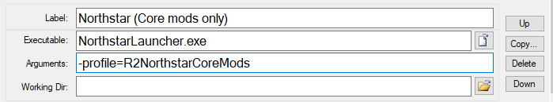

# Advanced Options


This is a section detailing the more advanced parts of using Northstar, with some of them having a chance to potentially mess with your game. Setting your level too high, for example, will lock you out of Northstar's multiplayer until you reset your entire player stats, progress, and loadouts.


## Mod profiles 

Profiles are a way to launch a version of Northstar with specific mods enabled, differing per profile. These profiles are separated by folders that you create yourself, and add your own mods to.\
Currently, the only mod managers supporting profiles are [VTOL](https://github.com/BigSpice/VTOL) and [r2modman](https://thunderstore.io/package/ebkr/r2modman/).

### Creating a profile

The first thing you want to do while creating a new profile is to have a Northstar release version downloaded and ready to be used. You will only need the `R2Northstar` folder from this second version, as the rest of the `NorthstarRelease.vX.Y.Z.zip` doesn't matter to creating additional profiles.

You'll want to rename the `R2Northstar` folder to whatever you prefer it to be called, such as `R2NorthstarNoMods` if you'd like to have a normal Northstar installation without using additional mods. These profiles act entirely independently from the other folders, meaning you can use a mod in a folder without it affecting any others. The only downside to this, however, is that they must all be updated independently when a Northstar update is released. You can install any mods that you would like to `YourProfileName/mods`, and they will load when launching it, though, just like core mods, additional mods will all also need to be updated independently. 

In order to create the `.bat` to launch this profile, you'll need to first create a `.txt` file inside of your Titanfall2 directory, and name it whatever you would like. Inside of this `.txt` file, you'll want to put in `NorthstarLauncher.exe -profile=PROFILE FOLDER NAME HERE`, replacing all of `PROFILE FOLDER NAME HERE` with the name that you gave the folder you installed your mods to. After this, rename the file to `yourFileName.bat`. Double clicking or right clicking on the `.bat` file then hitting `open` will launch Northstar with the assigned profile.

You can set up profiles in an even more advanced way by setting up a way to use Steam to launch multiple different profiles from their newer launch menu that appears when you can launch a game in more ways than one. This is also covered [here](../installing-northstar/basic-setup.md#adding-alternate-launch-option-for-steam), and can be set up for profiles by simply adding the `-profile=PROFILE FOLDER NAME HERE` to the arguments of the new option for NorthstarLauncher, as seen below

## Setting levels using console commands 


This section can cause you to mess up your persistence (multiplayer user data) on Northstar if you set your levels too high! Make sure to read carefully!


With everything unlocked, there is no need to set your level to a higher level, but some users may still want to do so. In order to this, you'll need to open the in-game console with the `~` button on your keyboard and type in/copy and paste the relevant commands. Both of these require `sv_cheats 1` to be enabled on the server you're playing on, easily done by using `sv_cheats 1` in the console in a private match. 

`script GetPlayerArray()[0].SetPersistentVar("gen", INSERT_GEN_COUNT)` this command sets the Generation level of the player. You want to replace `INSERT_GEN_COUNT` with the number you want. Setting this number too high should work for leveling up, however it will display `g103` on your kill card.

`script GetPlayerArray()[0].SetPersistentVar("xp", INSERT_XP_COUNT)` this command sets the xp count of the player (meaning, the amount of kills required per level in order to level up). You want to replace `INSERT_XP_COUNT` with the number you want. Setting this number lower than 472 is recommended, as to not encounter issues.

If you experience strange issues after using these, you probably set something too high, and should follow the [resetting levels wiki section](../installing-northstar/troubleshooting.md#i-used-a-command-to-set-my-playergun-xp-level-and-i-set-it-too-high-so-now-my-game-crashes-when-trying-to-join-multiplayer).
